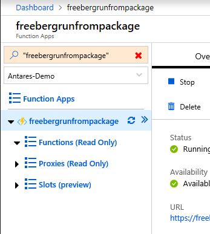
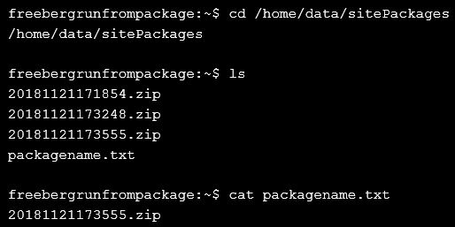

# Dogfooding the RunFromPackage Feature

>Checking user scenarios for Run-From-Package feature

## Setting up for local dev

1. Looked around online for 30 minutes on how to start a local project for a JS function
    - Visual Studio document only had C# templates
    - VS Code document wouldn’t allow Zip deployment
    - __"Download app content" button is broken__ (on Edge and Chrome)
1. Eventually found [this](https://docs.microsoft.com/en-us/azure/azure-functions/functions-create-first-azure-function-azure-cli) 
1. Install Azure Functions core tools
1. Create project with CLI
1. Editing with VS Code
1. Add logic for HTTP arguments
    - Imaginary scenarios where the user may write to the read-only directories

## Zip Deploy

1. Found [this doc](https://docs.microsoft.com/en-us/azure/azure-functions/deployment-zip-push) in the lefthand navigation pane while reading the doc in step 2 above
    - Easy to find, right under "Deploy" section
1. Deploy using:
    ```
    az functionapp deployment source config-zip -g freeberg-rfp2 -n freeberg-rfp2 --src C:\Users\jafreebe\Desktop\rfp_test2.zip
    ```
1. Then I find there is an option to [run from the deployment package](https://docs.microsoft.com/en-us/azure/azure-functions/deployment-zip-push#run-functions-from-the-deployment-package)
1. Remove my deployed functions from the app so I can redploy with the new setting
1. I go into the portal and add the environment variable `WEBSITE_RUN_FROM_PACKAGE` to `1`.
1. Redploy with the same command in step 2
1. See that the portal indicates the function is now "Read-Only"
    
1. **However**, the functions are not shown in the portal. The zip **is** visible under `/home/data/sitePackages/` but _there is no way of knowing that the deployment was successful from the Portal_.
    

## Run from package

1. Portal UI reminds the user that the App is now ready-only and their function is being run from a package
1. When I run the functions that are supposed to throw errors...

## Notes

- Finding the first document for initial, local development was difficult
    - Specifically to use JS development __and__  zip deployment
- **Add to TSG**:
    - If a Windows user right-clicks their project and "Sends to compressed folder", this will add an extra level of nesting and break the feature. This should be called out in the docs or fixed. 
    - There is a known bug where if a user...
        1. Deploys a .zip to a function app **without WEBSITE_RUN_FROM_PACKAGE=1**
        1. Then deletes the .zip
        1. Adds the env variable, `WEBSITE_RUN_FROM_PACKAGE` with a value of `1`
        1. Re-deploys their .zip
        ... Then the function app will not recognize the .zip 